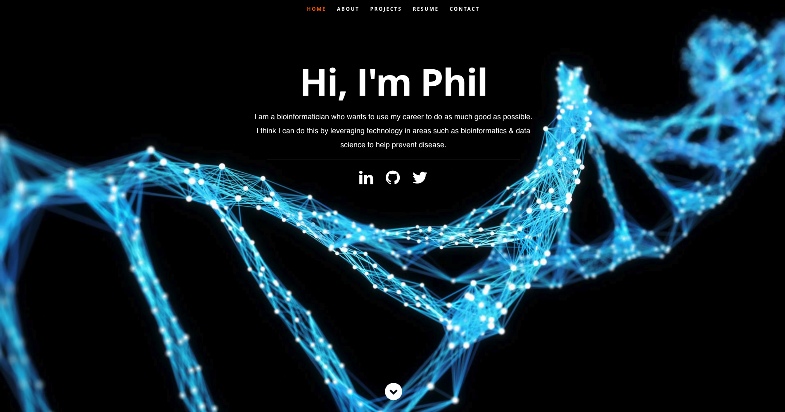

This is my SPA Portfolio built using React, to showcase my projects & skills. I intially forked it form @rbhatia46 & have made changes since. Feel free to fork this repo & use it to showcase your own work

## Preview
View my portfolio @ https://philpalmer.github.io/portfolio


## How to use
1. Clone/Download the repo.
2. Run  ``` npm install ```.
3. Change the values in ```src/resumeData.js``` to suit your use-case.
4. Run ```npm start``` to spin the up the local dev server port 3000.(http://localhost:3000).
5. Make required changes in ```src/resumeData.js``` to suit your needs.